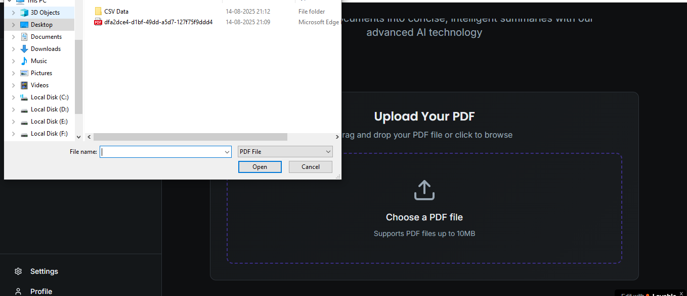
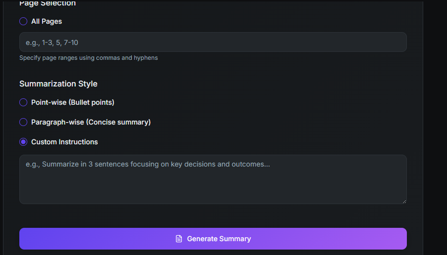

# PDF Summarizer

This project allows users to upload PDF files and get a summarized version of the content. The application is simple to use and provides a user-friendly interface for uploading and summarizing PDFs.

## Screenshots

Below are screenshots of the application's main features:

### Home Page

The home page provides an overview of the application and guides users on how to get started with uploading and summarizing their PDF files.

### Upload Page

The upload page allows users to select and upload their PDF documents. It features a clean interface for easy file selection and submission.

### PDF Upload Confirmation

After uploading a PDF, users are shown a confirmation page indicating successful upload and providing options for further actions.

### Custom Summary Page

The custom summary page displays the summarized content of the uploaded PDF, allowing users to review and copy the summary as needed.

## Usage
1. Open the application.
2. Upload your PDF file.
3. View the summary generated for your document.

## Tech Stack
- HTML
- CSS
- JavaScript
- PDF preview and summary logic handled in-browser

## Features
- Upload PDF files
- Summarize PDF content
- User-friendly interface
- Visual feedback for uploads and summaries

## Installation
1. Clone the repository:
	```powershell
	git clone https://github.com/Priyanshi-Solanki/PDF-summarizer.git
	```
2. Navigate to the project directory:
	```powershell
	cd PDF-summarizer
	```

## How to Run
1. Open the `index.html` file in your web browser.
2. Use the interface to upload a PDF and generate a summary.
